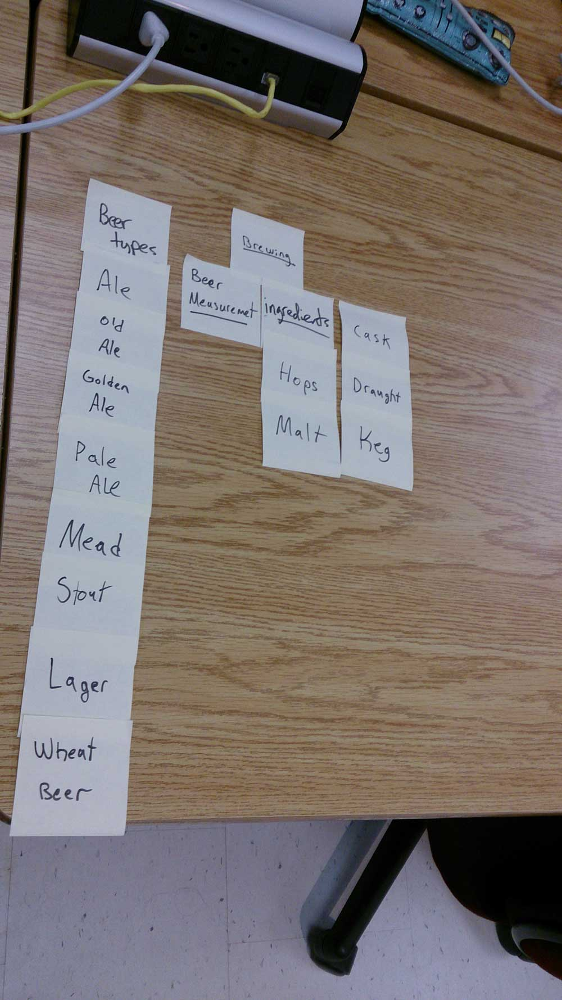
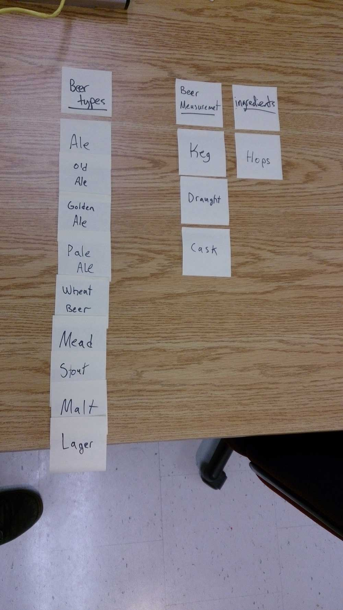

## Specifics

The card sort was conducted by Nigel Elton on Tuesday September 10th 2013 between the times of 5:00pm and 6:00pm with the following participants:

- James Gollner
- Grace Walker

### Cards

17 cards were used covering a broad range of applicable content for the website. The following topics were used as cards:

1. Beer type
2. Ale
3. Old Ale
4. Golden Ale
5. Pale Ale
6. Mead
7. Stout
8. Lager
9. Wheat Beer
10. Beer Measurement
11. Brewing
12. Ingredients
13. Hops
14. Malt
15. Cask
16. Draught
17. Keg

## Card sort results

*Card sort 1 by James Gollner*

*Card sort 2 by Grace Walker*

## Observations

- Did the participants have any common comments?
	- Both participants categorized the beer types correctly and simlairily
	- Ingredients were placed correctly
	- There was confusion on beer measurement and storage
- Did they have questions that stood out?
	- What exactly was beer measurment
	- Was mead an ingredient or an actual beer 
- Did they find common groupings? Or were the groupings completely different?
	- Very similar groupings especially the beer type category
- Were some of the groupings completely unexpected?
	- I suppose beer measurement, it's actually about colour and alchohol percentage rather than storage measurements
- Were the results similar to your expectations?
	- Yes, the topic is very basic and straight forward for users
- How did you feel while watching them perform the task?
	- Thirsty